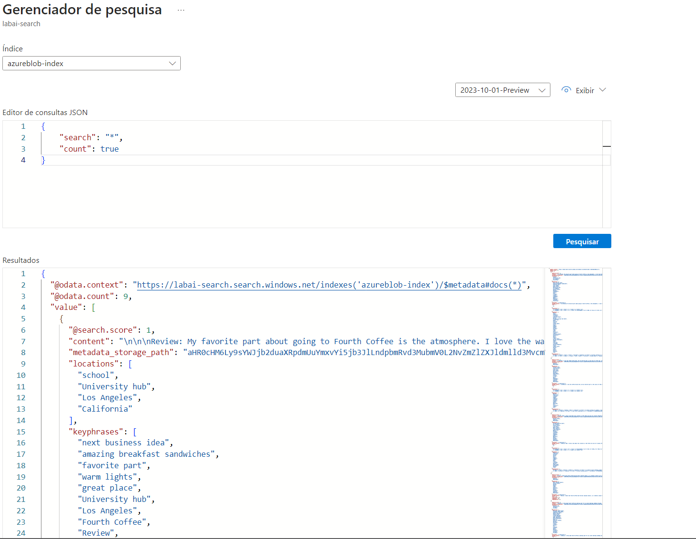
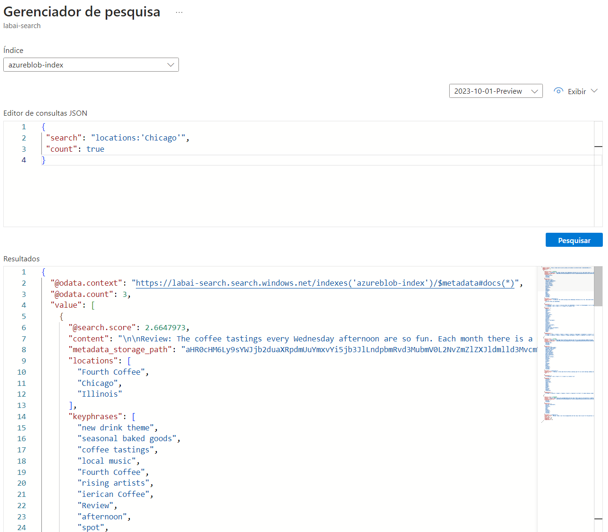
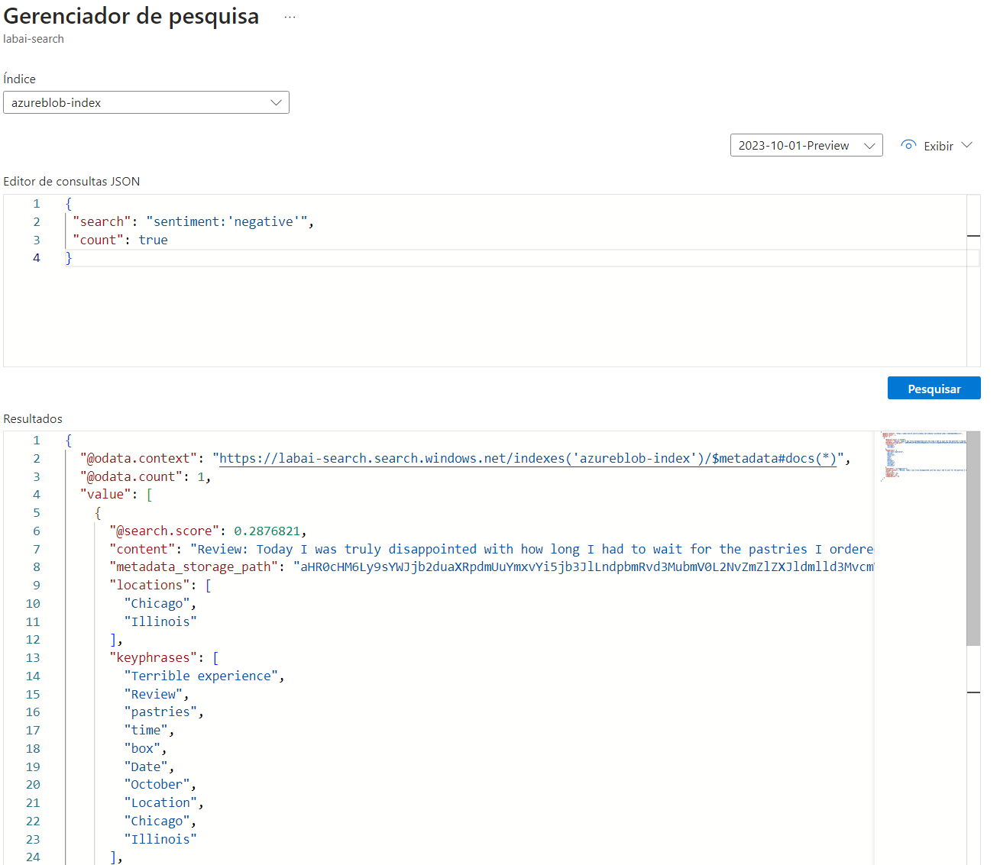

# dio-lab-azure-cognitive
Repositório para o projeto Azure Cognitive Search: Utilizando AI Search para indexação e consulta de Dados
<br>

# Configurar uma pesquisa utilizando Azure Cognitive Search

## Recursos do Azure necessários

- Um recurso de Pesquisa Azure AI, que gerenciará a indexação e a consulta.
- Um recurso de serviços de IA Azure AI, que fornece serviços de IA para habilidades que sua solução de pesquisa pode usar para enriquecer os dados na fonte de dados com insights gerados por IA.
- Uma conta de armazenamento com contêineres de blobs, que armazenará documentos brutos e outras coleções de tabelas, objetos ou arquivos.

## Passos

1. **Criar um recurso de Pesquisa Azure AI**
   - Faça login no portal do Azure.
   - Clique em "+ Criar um recurso", procure por "Pesquisa Azure AI" e crie um recurso de Pesquisa Azure AI com as seguintes configurações:
     - Assinatura: Sua assinatura do Azure.
     - Grupo de recursos: Selecione ou crie um grupo de recursos com um nome único.
     - Nome do serviço: Um nome único.
     - Localização: Escolha qualquer região disponível.
     - Camada de preços: Básica
   - Após ver a resposta "Validação com sucesso", selecione "Criar".
   - Depois que a implantação for concluída, selecione "Ir para recurso".

2. **Criar um recurso de serviços de IA Azure**
   - Volte para a página inicial do portal Azure. Clique no botão "+ Criar um recurso" e pesquise por "Serviços de IA Azure".
   - Selecione para criar um plano de serviços de IA Azure. Você será levado a uma página para criar um recurso de serviços de IA Azure com as seguintes configurações:
     - Assinatura: Sua assinatura do Azure.
     - Grupo de recursos: O mesmo grupo de recursos que seu recurso de Pesquisa Azure AI.
     - Região: A mesma localização que seu recurso de Pesquisa Azure AI.
     - Nome: Um nome único.
     - Camada de preços: Padrão S0
   - Marque a caixa de seleção para confirmar que leu e entendeu todos os termos abaixo: Selecionado
   - Selecione "Revisar + criar". Após ver a resposta "Validação aprovada", selecione "Criar".

3. **Criar uma conta de armazenamento**
   - Volte para a página inicial do portal do Azure e selecione o botão "+ Criar um recurso".
   - Pesquise por "Conta de armazenamento" e crie um recurso de Conta de armazenamento com as seguintes configurações:
     - Assinatura: Sua assinatura do Azure.
     - Grupo de recursos: O mesmo grupo de recursos que seus recursos de Pesquisa Azure AI e Serviços de IA Azure.
     - Nome da conta de armazenamento: Um nome único.
     - Localização: Escolha qualquer localização disponível.
     - Desempenho: Padrão
     - Redundância: Armazenamento redundante local (LRS)
   - Clique em "Revisar" e depois em "Criar". Aguarde a implantação ser concluída e vá para o recurso implantado.

4. **Carregar documentos no armazenamento Azure**
   - No menu à esquerda, selecione "Containers".
   - Selecione "+ Container". Uma janela será aberta.
   - Insira as seguintes configurações e clique em "Criar":
     - Nome: coffee-reviews
     - Nível de acesso público: Contêiner (acesso de leitura anônimo para contêineres e blobs)
   - [Baixe as avaliações de café compactadas de reviews](https://aka.ms/mslearn-coffee-reviews) e extraia os arquivos para a pasta "reviews".
   - No portal do Azure, selecione seu contêiner coffee-reviews. No contêiner, selecione "Upload".
   - No painel de Upload de blob, selecione "Selecionar um arquivo".
   - Na janela Explorer, selecione todos os arquivos na pasta reviews, selecione "Abrir" e depois "Upload".
   - Depois que o upload estiver completo, você pode fechar o painel de Upload de blob. Seus documentos agora estão em seu contêiner de armazenamento coffee-reviews.

5. **Indexar os documentos**
   - Depois de ter os documentos no armazenamento, você pode usar a Pesquisa Azure AI para extrair insights dos documentos. O portal do Azure fornece um Assistente de importação de dados. Com este assistente, você pode criar automaticamente um índice e um indexador para fontes de dados suportadas. Você usará o assistente para criar um índice e importar seus documentos de pesquisa do armazenamento para o índice de Pesquisa Azure AI.
   - No portal do Azure, navegue até o recurso de Pesquisa Azure AI. Na página Visão geral, selecione "Importar dados".
   - Na página Conectar-se aos seus dados, na lista de Fontes de dados, selecione "Armazenamento de Blob do Azure". Preencha os detalhes do armazenamento de dados com os seguintes valores:
     - Fonte de dados: Armazenamento de Blob do Azure
     - Nome da fonte de dados: coffee-customer-data
     - Dados para extrair: Conteúdo e metadados
     - Modo de análise: Padrão
     - Cadeia de conexão: *Selecione Escolher uma conexão existente. Selecione sua conta de armazenamento, selecione o contêiner coffee-reviews e depois clique em Selecionar.
     - Autenticação de identidade gerenciada: Nenhum
     - Nome do contêiner: esta configuração é preenchida automaticamente após você escolher uma conexão existente.
     - Pasta de blob: Deixe em branco.
     - Descrição: Avaliações das lojas Fourth Coffee.
   - Selecione "Avançar: Adicionar habilidades cognitivas (Opcional)".

6. **Adicionar habilidades cognitivas (Opcional)**
   - Na seção Anexar Serviços Cognitivos, selecione seu recurso de Serviços de IA Azure.
   - Na seção Adicionar enriquecimentos:
     - Altere o nome do Conjunto de habilidades para coffee-skillset.
     - Selecione a caixa de seleção Habilitar OCR e mesclar todo o texto no campo merged_content.

       **Observação:** É importante selecionar Habilitar OCR para ver todas as opções de campo enriquecido.

     - Verifique se o campo de Dados de origem está definido como merged_content.
     - Altere o nível de granularidade de Enriquecimento para Páginas (pedaços de 5000 caracteres).
     - Não selecione Habilitar enriquecimento incremental.
     - Selecione os seguintes campos enriquecidos:

       | Habilidade Cognitiva          | Parâmetro     | Nome do Campo  |
       | ----------------------------- | ------------- | -------------- |
       | Extrair nomes de localização |               | locations      |
       | Extrair frases-chave         |               | keyphrases     |
       | Detectar sentimento          |               | sentiment      |
       | Gerar tags de imagens        |               | imageTags      |
       | Gerar legendas de imagens    |               | imageCaption   |

   - Em Salvar enriquecimentos em um conhecimento armazenar, selecione:
     - Projeções de blob Azure: Documento.
     - Documentos
     - Páginas
     - Frases-chave
     - Entidades
     - Detalhes da imagem
     - Referências de imagem

     **Observação:** Se aparecer um aviso pedindo uma Cadeia de Conexão da Conta de Armazenamento. Selecione Escolher uma conexão existente. Escolha a conta de armazenamento que você criou anteriormente.

   - Clique em + Container para criar um novo contêiner chamado knowledge-store com o nível de acesso privado e selecione Criar.
   - Selecione o contêiner knowledge-store e, em seguida, clique em Selecionar na parte inferior da tela.
   - Selecione Projeções de blob Azure: Documento. Uma configuração para Nome do contêiner com o contêiner knowledge-store preenchido automaticamente é exibida. Não altere o nome do contêiner.
   - Selecione Avançar: Personalizar índice de destino. Altere o nome do Índice para coffee-index.
   - Verifique se a Chave está definida como metadata_storage_path. Deixe o nome do Sugestor em branco e o modo de Pesquisa autopreenchido.
   - Revise as configurações padrão dos campos de índice. Selecione filtrável para todos os campos que já estão selecionados por padrão.
   - Selecione Avançar: Criar um indexador.
   - Altere o nome do Indexador para coffee-indexer.
   - Deixe o Agendamento definido como Uma vez.
   - Expanda as opções Avançadas. Verifique se a opção Codificar chaves em Base-64 está selecionada, pois a codificação de chaves pode tornar o índice mais eficiente.
   - Selecione Enviar para criar a fonte de dados, o conjunto de habilidades, o índice e o indexador. O indexador é executado automaticamente e executa o pipeline de indexação, que:
     - Extrai os campos de metadados e conteúdo do documento da fonte de dados.
     - Executa o conjunto de habilidades de habilidades cognitivas para gerar mais campos enriquecidos.
     - Mapeia os campos extraídos para o índice.
   - Retorne à página de recurso de sua Pesquisa Azure AI. No painel esquerdo, em Gerenciamento de Pesquisa, selecione Indexadores. Selecione o indexador coffee-indexer recém-criado. Aguarde um minuto e selecione ↻ Atualizar até que o Status indique sucesso.
   - Selecione o nome do indexador para ver mais detalhes.

7. **Consultar o índice**
   - Use o Explorer de Pesquisa para escrever e testar consultas. O Explorer de Pesquisa é uma ferramenta incorporada no portal do Azure que oferece uma maneira fácil de validar a qualidade do seu índice de pesquisa. Você pode usar o Explorer de Pesquisa para escrever consultas e revisar resultados em JSON.
   - Na página Visão geral do seu serviço de Pesquisa, selecione Explorer de Pesquisa no topo da tela.
   - Observe que o índice selecionado é o coffee-index que você criou. Abaixo do índice selecionado, altere a visualização para visualização JSON.
   
   ## Filtro por todos
   No campo de editor de consulta JSON, copie e cole:
   #### Entrada
     ```
     {
         "search": "*",
         "count": true
     }
     ```
     #### Saída

     

   Selecione **Pesquisar**. A consulta de pesquisa retorna todos os documentos no índice de pesquisa, incluindo uma contagem de todos os documentos no campo @odata.count. O índice de pesquisa deve retornar um documento JSON contendo os resultados da sua pesquisa.

    ## Agora vamos filtrar por localização. 
    No campo do editor de consulta JSON, copie e cole:

    #### Entrada

     ```
     {
      "search": "locations:'Chicago'",
      "count": true
     }
     ```

   Selecione **Pesquisar**. A consulta pesquisa todos os documentos no índice e filtra as análises com localização em Chicago. **Você deve ver 3 no campo @odata.count.**

    #### Saída

     


    ## Agora vamos filtrar por sentimento. 
    No campo do editor de consulta JSON, copie e cole:
    
    #### Entrada

     ```
     {
      "search": "sentiment:'negative'",
      "count": true
     }
     ```
    #### Saída

     

   Selecione **Pesquisar**. A consulta pesquisa todos os documentos no índice e filtra as análises com sentimento negativo. **Você deve ver 1 no campo @odata.count.**

Este passo a passo é o guia do processo de criação de um índice de pesquisa Azure AI para mineração de conhecimento em avaliações de clientes, desde a criação de recursos até a consulta de dados enriquecidos.

## Sobre o processo
Durante o processo, foi possível adquirir um conhecimento prático dos serviços Azure AI, bem como habilidades em mineração de texto e desenvolvimento de soluções de IA, auxiliando no preparo para desafios futuros em inteligência artificial e análise de dados. 
